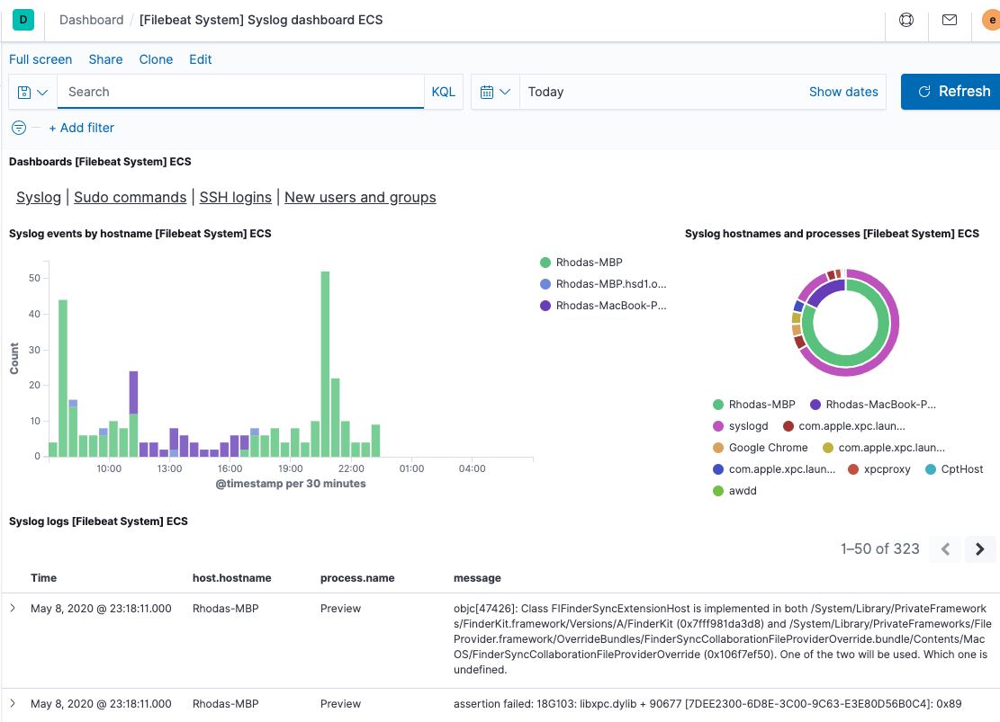

# Resultats

Présentation des résultats suite à la formation sur la suite Elastic (Elasticsearch, Logstash, Kibana, Beats) et la comparaison avec Opensearch.

## Elasticsearch

### Présentation

- Base de données NoSQL
- Repose sur le moteur Apache Lucene
- Permet de gérer un nombre très important de données
- Utile pour la recherche textuelle et le big data

### Nodes

- Machine physique
- Différents types de nodes
  - Master
  - Client
  - Data
    - Content
    - Hot
    - Cold
    - Warm
    - Frozen
  - ML, etc...
- Communiquent toutes ensembles pour créer un cluster
- Possibilité de créer plusieurs clusters et de les connecter ensemble afin de faire de la réplication cross-cluster
- Possibilité de définir des zones afin de répliquer dans les différentes zones

*Figure : Différents types de clusters*

### Index

- Groupe de documents
- Equivalent d'une table sur une BDD relationnelle

### Similarity Model

Utilisation de TF (term frequency), IDF (inverse document frequency) et Field length norm pour calculer si un resultat est interessant ou non.

Le modèle par défaut utilisé par Elasticsearch est Okapi BM25. Il est basé sur l'algorithme TF/IDF. 
Anciennement, le modèle par défaut était le classic TF/IDF.
On utilise le boolean model pour les recherches précises où l'on souhaite des correspondances exactes.

Okapi BM25
- Term frequency saturation
- Field length normalization on a per-field basis

### Sharding et réplicas

*Figure : Structure d'un index*

- Shards
  - Morceaux d'index
  - Permet d'augmenter les performances de recherche
  - Possibilité de cibler un shard ou un groupe de shards pour l'indexation et la recherche
  - Impossible de modifier le nombre de shards d'un index après sa création
  - 1 shard = 1 index Apache Lucene
- Réplicas
  - Duplication de shards
  - Permet d'augmenter les performances de recherche lorsqu'il y a beaucoup de requêtes simultanées
  -  Il y a toujours des shards primaires qui s'occupent de l'indexation
  -  Résiliance à la panne
  -  Les réplicas ne peuvent pas être situés sur le même node que le shard principal

*Figure : Allocation des shards et des réplicas sur les noeuds du cluster*

### Data stream

- Une sorte d'alias pour un index
- Permet de gérer automatiquement les indices
- Le data stream est créé par rapport à un template d'index
- Le template d'index définit :
  - Le mapping des champs
  - Le nombre de shards
  - Le nombre de réplicas
  - Des options spéciales pour le routing ou les politiques de gestion de l'index
- Il est possible de faire une rollover sur le datastream afin de créer un nouvel index qui va être responsable d'ingérer les prochaines données
- Ceci peut être utile pour générer automatiquement des nouveaux indices en fonction de règles définies dans une politique de gestion

*Figure : Fonctionnement d'un data stream*

### Politique de gestion des indices

- Permet de gérer le cycle de vie d'un index
- Définit un ensemble de phases
- Actions à effectuer pour chacune des phases
  - Rollover
  - Rollup
  - Snapshot
  - Modification du noeud
  - Modification du nombre de réplicas
  - Réindexation avec un certain nombre de shards
  - etc...
- Conditions de transition d'une phase à une autre
  - Age de l'index
  - Nombre de documents
  - Taille de l'index
  - Taille des shards
  - etc...
- Possibilité d'affecter une politique à un ensemble d'indices grâce à un wildcard

*Figure : Exemple de politique de gestion des indices*

### Snapshots

<color style="color: red">TODO</color>

## Kibana

### Présentation

- Outil permettant la visualisation des données
- Récupère les données depuis Elasticsearch
- 

### Rollup

- Création d'agrégats à partir d'un index
- Personnalisable, on doit configurer les agrégats
- Peut permettrer de supprimer des indices lorsqu'ils sont trop vieux tout en sauvegardant des informations pertinentes
- Peut être intégré dans une politique de gestion d'index (plus possible sur elasticsearch voir Downsample)

### Downsample

- Création d'agrégats à partir d'un index à des intervalles réguliers
- Pas personnalisable, les agrégats sont faits sur toutes les métriques de l'index
- Peut être intégré dans une politique de gestion d'index

## Logstash

### Présentation

- Outil pour la collecte et la transformation de logs
- Repose sur trois phases
  - Input
  - Filter
  - Output
- Permet de définir des pipelines différentes en fonction des types de logs

*Figure : Fonctionnement d'une pipeline*

### Input

- Source des données en entrée
- De nombreux plugins existent pour gérer différentes situations
  - Fichiers
  - Beats
  - Http
  - Kafka
  - RabbitMQ
  - etc...
- Le codec permet de transformer les données dès maintenant notamment si c'est du texte au format json
- Il est possible de gérer des logs multilignes en spécifiant les patterns de début ou de milieu des logs

### Filter

- Modifie le format des logs
- Permet d'extraire les données d'un texte
- Permet de changer le type des données (int, float, ...)
- Permet d'extraire d'autres données (geoip)
- Liste de plugins intéressants :
  - Grok : permet l'extraction de données depuis un texte
  - Date : permet de gérer les dates
  - Mutate : permet d'effectuer des transformations
    - Conversion de type
    - Suppression de champs
    - Ajout de champs
  - Geoip : permet d'extraire des informations à partir d'une adresse IP
  - Useragent : permet d'extraire des informations à partir d'un user agent

### Output

- Transmet les logs fromattés
- De nombreux plugins existent
  - Elasticsearch
  - Opensearch
  - Kafka
  - RabbitMQ
  - etc...

### Pipeline

- Fichier YAML définissant un ou plusieurs input, des filtres et un ou plusieurs output
- On peut mettre des conditions ce qui va permettre d'effectuer des filtres ou de sélectionner les outputs
- Il est possible de supprimer un log avec le plugin *drop*
- Pour plus de lisibilité, il peut être intéressant de faire plusieurs pipelines si possible plutôt que d'utiliser les structures conditionnelles
- Il est possible de chainer les pipelines (l'output d'une pipeline est l'input d'une autre pipeline)
- Le chainage peut être très utile afin de différencier différents types de logs provenant d'une même source
  - Si l'on reçoit des logs apache de type access et error depuis la même source (un beat par exemple)
  - On peut définir une pipeline qui va gérer l'input et qui va rediriger les logs sur deux pipelines différentes en fonction du type (access ou error)

*Figure : Présentation d'une pipeline plus avancée*

## Beats

### Présentation

- Outils pour la collecte de logs et de métriques
- Légers
- Différents Beats existants :
  - FileBeat : collecte de logs
  - MetricBeat : collecte de métriques (statistiques)
  - PacketBeat : collecte des données sur le réseau
  - HeartBeat : collecte des données sur la disponibilité des services
  - etc...
- Collecte les données puis les envoies à un output

### Input

- Soit l'input par défaut (des fichiers pour FileBeat par exemple)
- Soit un module
  - Il existe de nombreux module qui permettent de faciliter la récupération et la transformation des données
    - Apache
    - Nginx
    - Kibana
    - Elasticsearch
    - etc...
  - Les modules permettent également de créer des visualisations directement dans Kibana

### Output

- De nombreux output sont disponibles
  - Elasticsearch
  - Logstash
  - Kafka
  - Redis
  - etc...

### Intégration avec Kibana

Pour faciliter la création de dashboards dans Kibana, si on utilise des modules pour les beats, il est possible de générer tout un ensemble de ressources pour Kibana automatiquement.

*Figure : Dashboard dans Kibana généré automatiquement par FileBeat*

## Elastic vs Opensearch

Opensearch est un Fork de Elastic offrant deux solutions : Opensearch qui est l'équivalent de Elasticsearch et Opensearch Dashboards l'équivalent de Kibana. Les solutions de Opensearch sont entièrement gratuites contrairement à Elastic mais elles ne disposent pas de toutes les améliorations apportées à Elastic.

| Fonctionnalité | Elastic | Opensearch | Résultat |
|----------------|---------|------------|----------|
| ***Elasticsearch et Opensearch***                |
| Data Nodes         | Elasticsearch propose des rôles pour les différents tiers de data nodes (content, hot, warm, cold, frozen). Cela rend très facile la gestion des nodes et le cycle de vie des indices. | Opensearch propose un seul rôle (data) pour les data nodes. Il est possible de gérer différents tiers en ajoutant des attributs aux nodes. Cependant, il n'est pas possible d'avoir un niveau *content* comme dans Elasticsearch qui permettrait de stocker les indices systèmes par exemple. | La solution d'Elasticsearch est plus élégante et permet de bien gérer les différents tiers d'autant plus qu'il est tout de même possible d'ajouter des attributs sur les noeuds comme sur Opensearch. | 
| Data stream | - | Il n'est pas possible d'ajouter une politique de gestion des indices par défaut pour un datastream. | - |
| Politique de gestion des indices         | Elasticsearch propose les actions suivantes : (Allocate, Delete, Force merge, Migrate, Read only, Rollover, Downsample, Searchable snapshot, Set priority, Shrink, Ufollow et Wait for snapshot). Pour prendre un snapshot d'un index, il faut passer par une politique de gestion des indices et utiliser Wait for snapshot. Pour faire un rollup, il faut utiliser un rollup job mais cette fonctionnalité n'est pas encouragée.   | Opensearch propose les actions suivantes : (Force merge, Read only, Read write, Replica count, Shrink, Close, Open, Delete, Rollover, Notification, Snapshot, Index priority, Allocation et Rollup). | Les deux services proposent plus ou moins les mêmes services. Encore une fois Elasticsearch offre des solutions un peu plus avancées qui permettent d'obtenir un résultat plus élégant.  | 
| Rollup | La fonctionnalité n'est pas encouragée. Elle fonctionne cependant très bien et permet de visualiser les données dans les dashboards sans problèmes. Il est également possible de faire des requêtes à la fois sur les données Rollup et les données brutes. | Les jobs de rollups fonctionnent bien mais il est très difficile de faire fonctionner les dashboards. Le mapping fait par Opensearch Dashboards par défaut n'est pas le bon, il faut le modifier pour avoir accès aux vrais champs et j'ai eu des problèmes avec la gestion des dates. Pour l'instant je n'ai pas réussi à visualiser les données. La fonctionnalité permet plus de personnalisation que Elasticsearch. Il est possible de renommer les champs de sortie ce qui n'est pas possible avec Elasticsearch. | Bien que Opensearch permette plus de personnalisation, il m'a été impossible de visualiser les données Rollup ce qui rend la fonctionnalité inutilisable. |
| Downsample | Présent en preview | Non présent | - |
| Snapshots | Elastic | Opensearch | Résultat |
| ***Kibana et Opensearch dashboards***            |
| Lens | TODO | TODO | TODO |
| Canvas | TODO | TODO | TODO | 
| ***Beats***                                      |
| Dashboards Kibana | Les dahsboards sont automatiquement générés et envoyés dans Kibana. Il est possible de les mettre à jour automatiquement à chaque lancement des Beats notamment si il y a des changements de versions. | Il n'est pas possible d'insérer directement les dashboards dans Opensearch Dashboards. J'ai essayé de les injecter à la main en utilisant l'API mais je n'ai pas réussi à créer de Dashboard car il manquait des visualisations qui sont sans doutes de base dans Kibana. Il n'est donc pas possible d'utiliser les dashboards auto générés des Beats. | Pas d'intégration facile avec Opensearch Dashboards. | 

## Annexes

